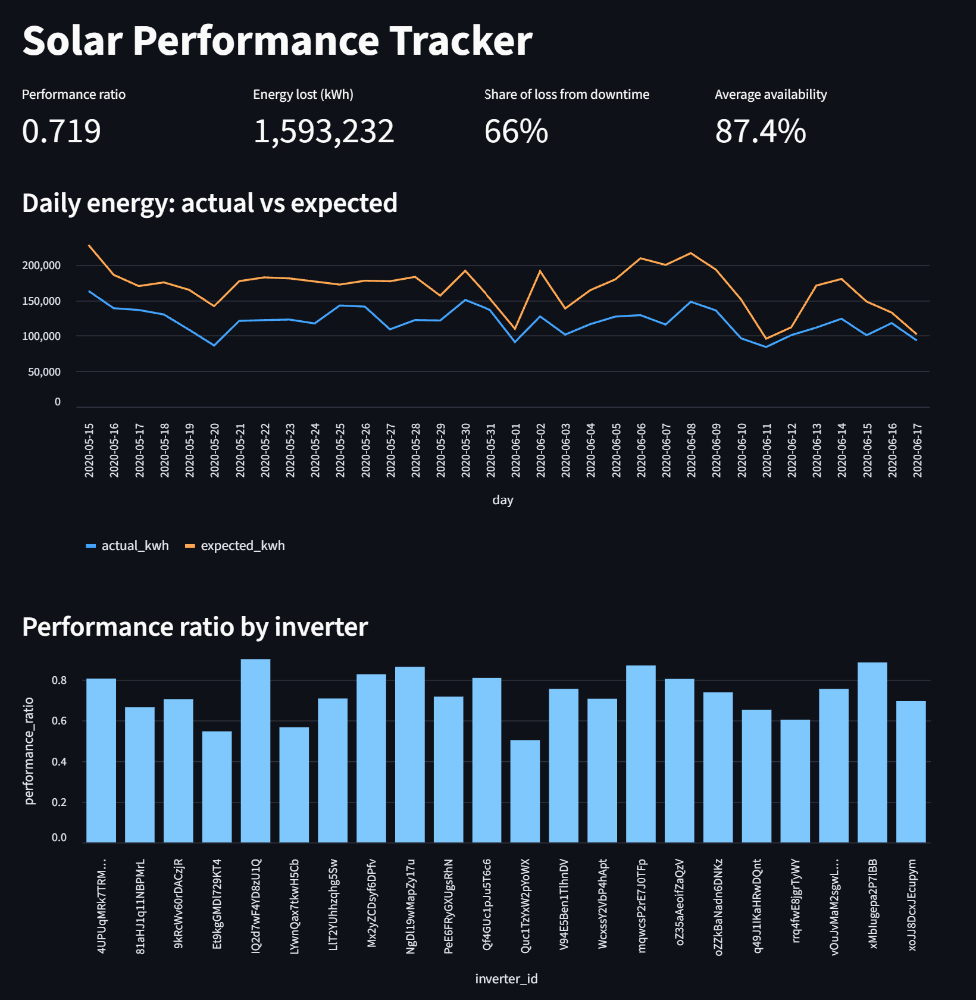

# Solar Performance Tracker

A Python and SQL pipeline that compares what a solar plant produced to what it should have produced given the weather, then flags the inverters that fell short and explains why.

I built this to learn how solar performance engineering works: pulling production data and meteorological data, joining them, and using the gap between expected and actual output to find problems.



## Key findings

The data covers two solar plants over 34 days (May 15 to June 17, 2020), with 44 inverters, 136,476 power readings, and 6,441 weather readings.

| | Plant 4135001 | Plant 4136001 |
|---|---|---|
| Performance ratio | 0.918 | 0.719 |
| Energy lost | 470,413 kWh | 1,593,232 kWh |
| Share of loss from downtime | 3.5% | 66.4% |
| Average availability | 99.8% | 87.4% |
| Flagged inverter days | 6 | 261 |

- **Plant 4135001 is healthy.** Its losses are small and spread evenly, and its inverters were running 99.8% of the sunny hours.
- **Plant 4136001 has an availability problem.** Two thirds of its lost energy came from inverters that were fully off while the sun was up. Its worst inverter made only 50% of its expected energy.
- **The outages cluster on the same days.** Several inverters went down together on May 27, June 6, and June 7. That points to a shared cause at the plant level instead of separate equipment failures.

## How it works

| Step | File | What it does |
|---|---|---|
| 1 | `src/explore.py` | First look at the raw CSV files |
| 2 | `sql/schema.sql`, `src/load_data.py` | Builds a normalized SQLite database and loads the data |
| 3 | `src/quality_checks.py` | SQL checks for missing readings, bad values, and outages |
| 4 | `src/performance.py` | Models expected output with pvlib and calculates performance ratio |
| 5 | `sql/analysis.sql`, `src/flag_issues.py` | SQL views that flag bad days and split losses by cause |
| 6 | `src/dashboard.py` | Streamlit dashboard |

**Expected output** comes from the PVWatts model in pvlib. It uses measured sunlight (irradiance) and panel temperature to work out what each inverter should produce.

**Performance ratio** is actual energy divided by expected energy. A value of 1.0 means the equipment produced everything the weather allowed.

## Data problems found and handled

Real sensor data is messy. The quality checks found these issues:

- **Mismatched date formats.** The production and weather files wrote dates in different styles. The loader converts both to one format so the tables can be joined.
- **A units error.** One plant's DC power was recorded 10 times too high. Its AC to DC ratio was 0.098, when a real inverter is near 0.98. The loader detects this and corrects it.
- **Missing readings.** Four inverters were each missing the same 9.5 days of data, which suggests a shared data logger outage.
- **Outages.** Readings with strong sun and zero output are kept and labeled as `down`, since they are real events and not bad data.

## Tools

Python, pandas, pvlib, SQL (SQLite), Streamlit

SQL features used: normalized schema with foreign keys, joins, views, common table expressions, window functions, and conditional aggregation.

## How to run it

1. Clone the repo and set up the environment:

   ```
   git clone https://github.com/natcol06/solar-performance-tracker.git
   cd solar-performance-tracker
   python -m venv venv
   source venv/Scripts/activate
   pip install -r requirements.txt
   ```

   On Mac or Linux, use `source venv/bin/activate` instead.

2. Download the [Solar Power Generation Data](https://www.kaggle.com/datasets/anikannal/solar-power-generation-data) set from Kaggle and put the four CSV files in `data/raw/`.

3. Run the pipeline in order:

   ```
   python src/load_data.py
   python src/quality_checks.py
   python src/performance.py
   python src/flag_issues.py
   streamlit run src/dashboard.py
   ```

## Limits

- **Inverter capacity is estimated.** The data set does not include nameplate ratings, so capacity is estimated from each plant's best readings. Comparisons between inverters are more reliable than the exact ratio values.
- **Missing data is not counted as a loss.** When readings are missing, there is no way to tell if the inverter was down or only the data logger. Those gaps are reported by the quality checks but left out of the loss totals.
- **The cause of the outages is unknown.** The data shows when inverters were down, not why.

## Possible next steps

- Compare the on-site sunlight sensor to satellite weather data to check the sensor
- Read a CAD site layout (DXF file) and show underperforming inverters on a site map
- Move the database from SQLite to PostgreSQL

## Data source

[Solar Power Generation Data](https://www.kaggle.com/datasets/anikannal/solar-power-generation-data) by Ani Kannal on Kaggle.